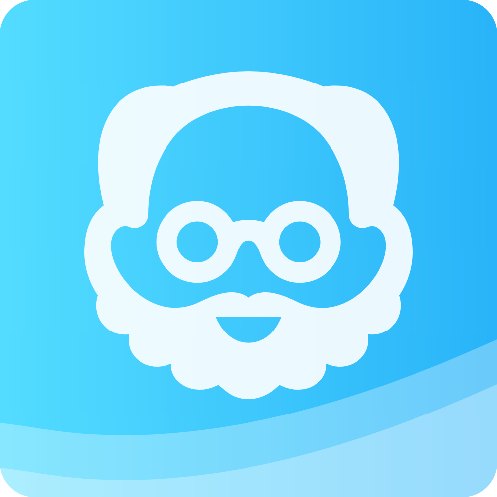
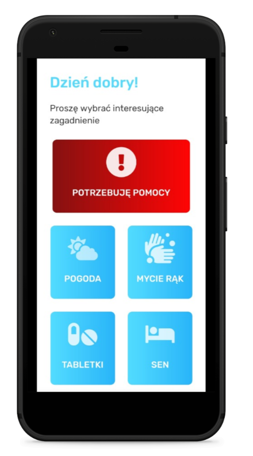
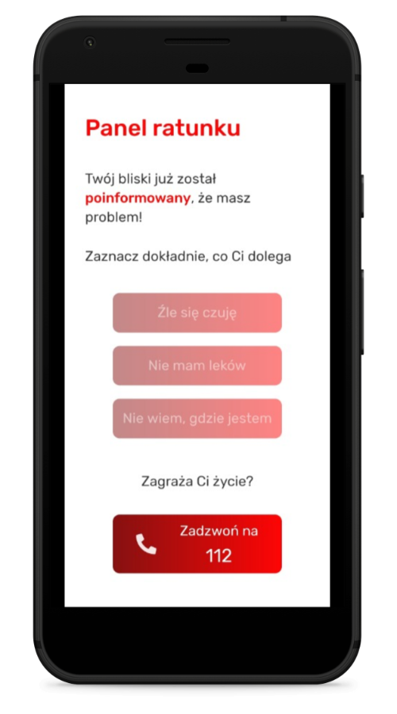
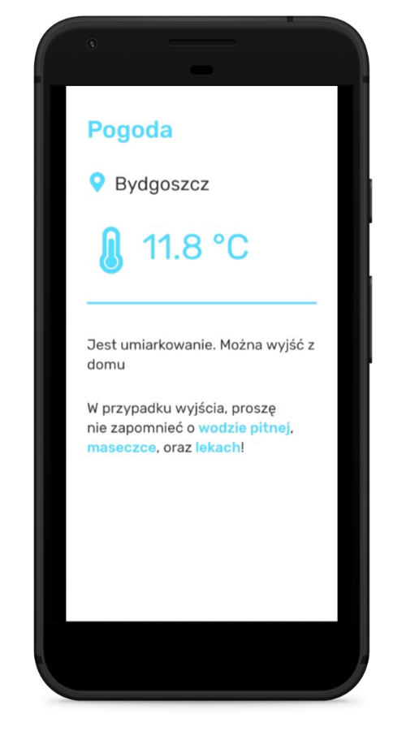
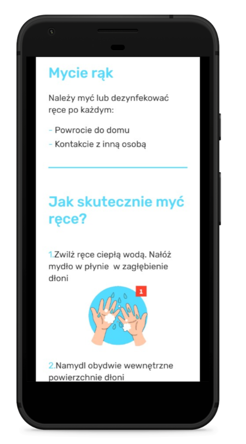
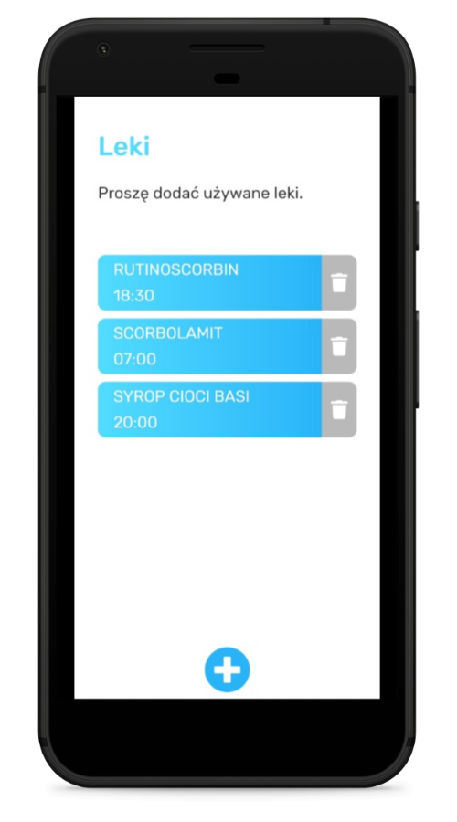
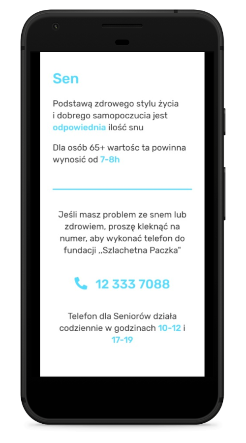
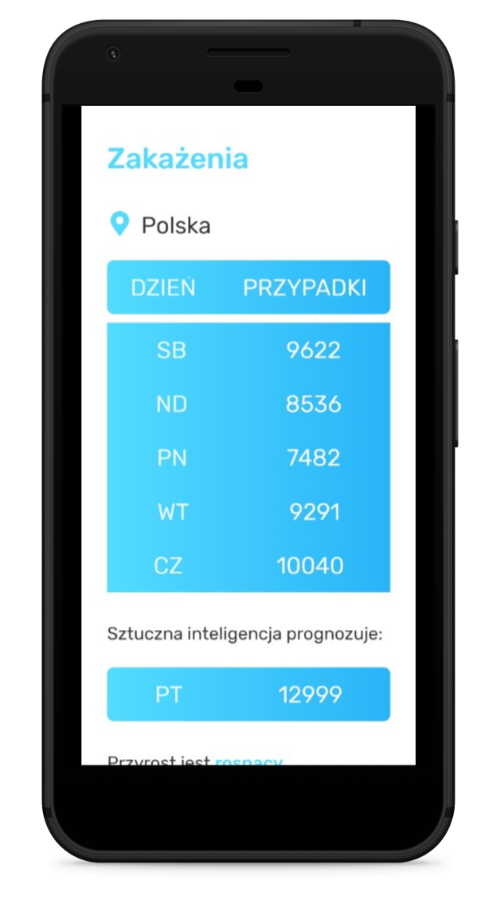
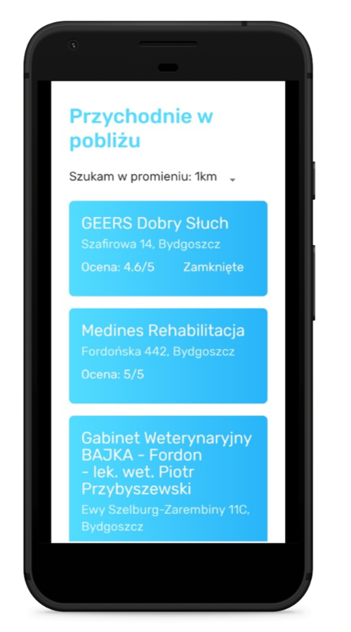

# Aplikacja "Zdrowy senior"

## Na jakie potrzeby/problem odpowiada Wasze rozwiązanie?

Mamy rok 2020. Następuje coraz większa cyfryzacja Polski oraz świata. Liczba osób korzystających z internetu regularnie wzrasta. Istnieje bardzo dużo aplikacji, których odbiorcami mają być z założenia osoby dorosłe, nastolatkowie, a nawet dzieci. W dobie pędzącego postępu technologicznego, w debacie publicznej, ale i na rozwijającym się rynku użytecznych dla codziennego życia aplikacji, często pomijane są potrzeby emerytów i seniorów.

Panuje powszechna opinia, że w Polsce osoby starsze nie korzystają z internetu oraz komputera, smartfonów itp. Jest to błędne rozumowanie - Ilość seniorów korzystających ze smartfonów regularnie się zwiększa, a patrząc na rosnącą liczbę emerytów w Polsce (4 500 000 w 2004 roku, a już 6 435 000 w 2017 roku) [1](https://www.zadluzenia.com/liczba-emerytow-w-polsce), można postawić tezę iż starszych użytkowników będzie regularnie przybywać.

Ponadto kompetencje seniorów w dziedzinie nowych technologii wciąż rosną.
W roku 2004 tylko 3% ludzi w wieku 65-74 używało smartfona. W 2017 było to już 14.9%, czyli około 950 000 osób[2](https://stat.gov.pl/obszary-tematyczne/nauka-i-technika-spoleczenstwo-informacyjne/spoleczenstwo-informacyjne/jak-korzystamy-z-internetu-2017,5,8.html)
Nie są to w każdym razie użytkownicy nieaktywni.
W samym roku 2019 ponad 500 000 użytkowników w wieku 65+ miało założonych konto na facebooku. [3](https://napoleoncat.com/stats/facebook-users-in-poland/2019/06)

Wniosek z tego jest prosty - Regularnie rośnie w Polsce liczba seniorów korzystających ze smartfonów i będą oni coraz częstszymi odbiorcami różnego typu aplikacji.

---

Powszechnie wiadomo, iż dla starszych ludzi wartością nadrzędną jest zdrowie. Szczególnie widoczne jest to teraz, w czasie pandemii. Seniorzy są największą grupą ryzyka. Zawsze zachęcani do "wyjścia z domu", dzisiaj muszą najlepiej w nich pozostać, aby być bezpieczni.

Emeryci, często sami, muszą sprostać obecnym czasom. Popyt rodzi podaż - Zrobiłem własny mini-sondaż i zapytałem się emerytów (sąsiadów, rodzinę, rodzinę znajomych), jakie są informacje, które chcieliby mieć obecnie pod ręką.

Oto wnioski które nasuwają się z tego sondażu:

- Seniorzy chcą mieć przede wszystkim prosty i szybki dostęp do prognozy pogody oraz informacji o dziennych zarażeniach Covid-19.
- Ankietowani chcieliby również posiadać możliwość zapisywania jaki mają wziąć lek i o której godzinie.
- Bardziej aktywni i podróżujący po Polsce seniorzy chcieliby w prosty sposób znaleźć najbliższą placówkę pomocy medycznej w pobliżu miejsca, gdzie się akurat znajdują.
- Ponadto opiekunowie oraz bliscy osób starszych chcieliby mieć szybki i prosty kontakt, a także natychmiastową możliwość otrzymania informacji, o potrzebie natychmiastowej pomocy.

Po zebraniu tych wszystkich wiadomości doszedłem do wniosku, że wśród seniorów jest ogromne zapotrzebowanie na aplikację, która będzie zawierała w sobie:

- Stan aktualnej pogody
- Informacje o dziennej ilości zakażeń
- System zapisywania leków i godziny, o której trzeba je wziąć
- Możliwość znalezienia przychodni w pobliżu
- Panel alarmowy, w którym starszy użytkownik będzie mógł zgłosić, że potrzebuje pomocy, a opiekun lub bliscy pozostaną poinformowani

Obecnie seniorzy muszą korzystać z 5 różnych aplikacji lub stron internetowych, aby móc obsługiwać te funkcjonalności.

Ponadto, w dobie pandemii, zapoznając się z wytycznymi Głównego Inspektoratu Sanitarnego, stwierdziłem że starszym ludziom przyda się również informacja o myciu rąk oraz odpowiedniej ilości snu.
Dzięki temu wszystkie najważniejsze informacje dla seniorów będą dostępne w jednym miejscu.

Podsumowując - W Polsce rośnie liczba użytkowników, którzy muszą używać wielu aplikacji, chcąc w kwestiach zdrowotnych pozyskać rożnego rodzaju informacje. Tymczasem moja aplikacja zawiera wszystkie te informacje w jednym miejscu.

## W jakich językach programowania, jakich technologiach powstała aplikacja/narzędzie

Do stworzenia aplikacji użyto **React Native** w oparciu o expo-cli, czyli najbardziej nowoczesnego narzędzia w 2020 roku, konkurującego z Flutterem.

W kodzie zaimplementowano hooki i komponenty na bazie Function Based Components, które są bardziej nowoczesne od Class Based Components, dzięki czemu kod jest bardziej przejrzysty i łatwiej jest go rozwijać oraz debuggować.

W kodzie JavaScript'u zastosowano najnowsze standardy - Przede wszystkim ES6+. W projekcie wykorzystano takie możliwości jak destrukturyzacja oraz arrow functions.

W przypadku rozwoju projektu wśród większej grupy programistów (gdzie każda osoba stosowałaby inne praktyki dotyczące stylistyki kodu), użyto także narzędzia prettier oraz eslint. Dzięki temu, każda osoba dołączająca do team'u rozwijającego aplikację będzie musiała się zastosować do standardów użytych w projekcie (jak np. używanie pojedynczych znaków cudzysłowie, nie stosowanie niepotrzebnych średników).

Warto również zaznaczyć, że zadbano o UX oraz UI. Aplikacja ma bardzo prosty i przejrzysty interfejs - Zastosowano duży font, kolory kontrastujące ze sobą oraz duże kafelki w menu głównym, dzięki czemu nawet starsza osoba nie mająca styczności z aplikacjami mobilnymi będzie potrafiła ją obsłużyć w intuicyjny sposób.

Podział plików w projekcie wyglądał tak:

- **assets** - Wszelkiego rodzaju zdjęcia, ilustracje i ikonki
- **components** - Komponenty, które są używane w różnych miejscach projektu
- **layout** - Główny komponent aplikacji oraz specyfikacja kolorów, fontu i innych rzeczy stylistycznych
- **screens** - Screeny aplikacji. W każdym folderze znajduje się tylko jeden plik z rozszerzeniem js. Jest to plik zawierający screen danej sekcji
  - _(opcjonalnie)_ **partials** - Folder z komponentami dedykowanymi dla określonego screenu. Pozwala to zdestrukturyzować dany screen i zachować porządek w projekcie
- **utils** - Czyli miejsce na wszystkie inne pliki. W moim przypadku to jedynie plik z kluczami do API

Nie spotkałem się nigdy z fachową nazwą na taką strukturę projektu. Rozdziela ona doskonale logikę aplikacji i czyni strukturę projektu przejrzystą. Bardzo często właśnie taką strukturę widzę podczas przeglądania kodu innych, bardziej doświadczonych ode mnie programistów.

Do nazywania zmiennych użyto metodologii **"Camel Case"**.

W przypadku błędu (na przykład nie włączony GPS podczas pobierania lokalizacji), aplikacja wyświetla odpowiedni komunikat na ekran.

Warto również zwrócić uwagę na wykorzystanie dwóch powszechnie znanych paradygmatów:

- **DRY** (Don't Repeat Yourself) - Używam wielokrotnie raz zdefiniowanych komponentów (folder components) oraz kolorów (plik theme.js)
- **SOLID** - A właściwie pełne wykorzystanie możliwości O (open/closed principle) - Struktura projektu jest otwarta na rozszerzenia, bez potrzeby zmiany kodu źródłowego)

W kodzie zamieszczono dużo komentarzy mówiących o tym, za co odpowiada dana funkcja lub komponent, dzięki czemu kod jest czytelny

Użyłem także następujących bibliotek oraz interfejsów API:

- Expo-location do pobrania informacji poprzez GPS o tym, w jakim mieście znajduje się użytkownik
- OpenWeatherAPI do pobrania danych na temat temperatury w określonym mieście
- AsyncStorage do zapisywania harmonogramu leków w pamięci urządzenia
- Expo-linking do możliwości zainicjowania połączenia telefonicznego
- Tensorflow do przewidywania ilości zachorowań na bazie sztucznej inteligencji
- API od NovelCOVID do ilości zarażeń
- API od Google Maps w celu znalezienia przychodni w pobliżu

Inne biblioteki, których użyłem to:

- Styled Components do stylowania komponentów aplikacji
- Axios do wykonywania requestów
- DateTimePicker do zaznaczenia godziny wzięcia leku
- Expo-linear-gradient do tworzenia gradientu
- React-native-picker-select do zaznaczania promienia podczas znajdywania przychodni

Wszystkie ikonki użyte w projekcie są darmowe i pochodzą z serwisu fontawesome.com

## Opisz działanie Waszej aplikacji/narzędzia

Aplikacja zawiera 7 sekcji, a każda z nich zawiera określone informacje, bądź udostępnia użytkownikowi daną funkcjonalność.

Założenie jest takie, że z aplikacji korzystają osoby starsze, które chcą mieć wszystkie potrzebne im informacje i dane w jednym miejscu.  
Obecny stan projektu udostępnia użytkownikom 7 sekcji, do których można przejść z ekranu startowego.
Jak wspomniano, głównymi odbiorcami aplikacji są seniorzy, dlatego też cały layout oraz design jest oparty o możliwie najprostszy interfejs w celu ułatwienia użytkowania. Dzięki zastosowanemu podejściu, nawet osoby nieobyte z technologiami poradzą sobie z użytkowaniem.

Po włączeniu aplikacji, użytkownik pojawi się na stronie głównej i wyświetlą mu się kafelki z nazwami sekcji oraz czytelną i intuicyjną ikonką.

Aplikacje zawierające dużo informacji często muszą się kojarzyć z przytłaczającą ilością tekstu - Nie jest to wygodne dla emerytów, którzy często mają problem ze wzrokiem czy koncentracją.
Dlatego też w "Zdrowym Seniorze" zastosowano bardzo dużo ilustracji poglądowych oraz ikonek - Te w prostszy sposób przemawiają do użytkowników i zapewniają lepsze "User Experience".
Użyty tekst natomiast jest skrócony do minimum, a także nie jest w żaden sposób hermetyczny. Słowa kluczowe są pogrubione oraz oznaczone innym kolorem.
Wszystkie wymienione funkcjonalności dają gwarancję, że starszy użytkownik nie będzie miał problemu z odczytaniem zawartości tekstu.

W przypadku błędu (na przykład wyłączony GPS podczas pobierania lokalizacji), aplikacja wyświetla odpowiedni komunikat na ekran.

Podczas pobierania danych z serwera, gdy dana sekcja się jeszcze ładuje, na ekranie wyświetla się obracające kółeczko symbolizujące ładowanie.

Aplikacja zawiera 7 sekcji:

### Panel ratunku

Niestety, duża część osób w podeszłym wieku ma problemy ze zdrowiem. Potrzebują oni bieżącego kontaktu z opiekunem bądź osobami bliskimi. I vice versa - Te osoby chciałyby zostać natychmiastowo powiadomione, jeśli seniorowi coś będzie dolegać.

W kryzysowej sytuacji, starszy człowiek może się skontaktować ze swoim bliskim poprzez panel pomocy.
W założeniu, podpięty pod danego seniora opiekun lub bliski zostanie natychmiast powiadomiony (np drogą SMS) o włączeniu Panelu Ratunku przez starszą osobę. Dzięki tej funkcjonalności senior nie musi wybierać numeru telefonu, ani pisać SMS-a. Wystarczy jedno kliknięcie aby skontaktować się z opiekunem.

Aplikacja jest zabezpieczona przed przypadkowym włączeniem panelu ratunku. Po kliknięciu na niego w menu głównym, użytkownik jest zapytany czy na pewno zagraża mu niebezpieczeństwo i czy chce powiadomić swojego bliskiego.

Aplikacja zapobiega powstaniu sytuacji, w której osoba powiadomiona nie ma dokładnych informacji, co się dzieje z poszkodowanym. Senior może ze swojego panelu jednym kliknięciem zaznaczyć dolegliwość, która mu dokucza. W aplikacji wymienione są przykładowe trzy:

- Źle się czuję
- Nie mam leków
- Nie wiem, gdzie jestem

Każda opcja ułatwia zrozumienie problemu. Jednym kliknięciem seniora już wiadomo, czy problem dotyczy braku leków, czy na przykład osoba starsza się zgubiła (co jest szczególnie powszechne w przypadku Alzheimera).

W przypadku bezpośredniego zagrożenia życia, aplikacja sugeruje zadzwonienie pod numer alarmowy. Nie wymaga to jednak konieczności wyłączenia aplikacji i potrzeby wpisania 112 ręcznie - Wystarczy nacisnąć na czerwony guziczek, aby został automatycznie wybrany numer alarmowy, na który można zadzwonić

_Oczywiście, jakoże projekt jest w fazie eksperymentów, po wciśnięciu numeru alarmowego zostanie automatycznie wybrany przykładowy numer 123-456-789, aby nie spowodować niepotrzebnego telefonu na 112._

Dzięki stworzeniu panelu pomocy, zagrożony użytkownik przy użyciu kilku kliknięć (bez potrzeby wpisywania czegokolwiek) może powiadomić opiekuna lub osobę bliską o danym zagrożeniu i opisać je.

---

### Pogoda

Podczas moich wywiadów z osobami starszymi, dowiedziałem się że najbardziej pożądaną funkcją w aplikacji jest pogoda. Dzięki niej, seniorzy nie musieliby czekać na określoną godzinę w celu sprawdzenia prognozy pogody w telewizji - Mogliby to zrobić wszędzie i o każdej porze.

Po przejściu do sekcji pogody senior zostanie poproszony o włączenie GPS w celu automatycznego określenia jego lokalizacji.
W przypadku odrzucenia prośby, wyświetla się komunikat informujący o tym, że do działania sekcji potrzebna jest lokalizacja GPS.

Po niezauważalnie krótkiej chwili czekania, użytkownik zobaczy w jakim jest mieście. Jest to oznaczone czytelną ikonką pinezki.
Dużym fontem napisana jest temperatura w stopniach Celsjuszach. Rzuca się ona w oczy dzięki większemu fontowi oraz niebieskiemu kolorowi. Obok wartości temperatury umiejscowiona jest ikonka termometru.

Poniżej znajduje się tekst. Informuje on o tym, jaka jest sytuacja na zewnątrz. Możliwe warianty to:

- **Chłodno** (mniej niż 10 stopni)
- **Umiarkowanie** (od 10 do 25 stopni)
- **Gorąco** (więcej niż 25 stopni)

Grubszym fontem jest napisane przypomnienie, aby w przypadku wyjścia z domu senior wziął ze sobą wodę pitną, maseczkę oraz niezbędne leki.

Dzięki zastosowaniu sekcji pogody, senior może w prosty sposób oraz w dowolnym miejscu i czasie sprawdzić wartość temperatury dla lokalizacji, w której się znajduje

---

### Mycie rąk

Higiena jest rzeczą, której powinna przestrzegać każda osoba. W szczególności dotyczy to osób starszych, bardziej podatnych na zarażenia.

Podstawową praktyką stosowania higieny jest mycie rąk. Chociaż może się to wydawać nieprawdopodobne, nie wszyscy potrafią dokonać tej czynności w sposób prawidłowy.
Ogłoszenia i kampanie o odpowiednim myciu rąk, które są prowadzone w formie wieszania plakatów w miejscach publicznych oraz rozdawania ulotek, mogą nie trafić do każdego.

Aplikacja, której regularnymi i stałymi odbiorcami są seniorzy, to dobre miejsce na instrukcje z zakresu mycia rąk.

W sekcji znajduje się krótka informacja o tym, kiedy należy umyć ręce lub je zdezynfekować.
Poniżej znajduje się instrukcja, która pokazuje w 7 krokach jak skutecznie umyć ręce. Wiedząc, że ilustracja jest dla wielu osób bardziej czytelna od tekstu, zdecydowałem się na umieszczenie poglądowych obrazków.

Cały tekst oraz zdjęcia pochodzą [ze strony internetowej](https://www.gov.pl/web/nauka/informacja-glownego-inspektora-sanitarnego-dla-uczelni-w-zwiazku-z-potencjalnym-ryzykiem-zakazenia-koronawirusem) Głównego Inspektoratu Sanitarnego.

Dzięki wymienionej sekcji, osoby starsze, obarczone większym ryzykiem zachorowań, mogą w prosty sposób sprawdzić jak poprawnie myć ręce

---

### Leki

Problemem, z którym muszą na co dzień zmierzać się osoby starsze jest regularne branie leków. Jest to uciążliwie - Seniorzy często zapisują na kartkach, jakie powinni wziąć leki i o której godzinie. Można tą czynność uprościć poprzez zapisywanie leków w aplikacji - Oszczędzi to niepotrzebnego zużycia papieru i ułatwi trzymanie wszystkiego w jednym miejscu.

Użytkownik w sekcji leków może zapisywać jakie leki bierze, oraz o której godzinie. Jeśli użytkownik nie ma zapisanego żadnego leku - Na ekranie wyświetli się tekst proszący o dodanie go.

Lek można dodać poprzez kliknięcie ikonki plusa na samym dole. Użytkownik zostanie wtedy zapytany o nazwę leku oraz o godzinę (domyślnie wybrana zostanie godzina obecna). Po wypełnieniu tych dwóch danych trzeba kliknąć przycisk "dodaj". Formularz zamknie się automatycznie i pojawi się lista wszystkich leków, wraz z tym dodanym.

Leki zapisują się w pamięci urządzenia, więc są cały czas dostępne dla użytkownika.

Lek można usunąć klikając na ikonkę śmietnika. Aby zapobiec przypadkowemu usunięciu, aplikacja pyta się użytkownika, czy na pewno chce usunąć dany lek.

Warto również wspomnieć o tym, że aplikacja zapobiega przypadkowemu zapisaniu leku bez nazwy. Jeśli input z nazwą jest bez wartości, kliknięcie w przycisk jest niemożliwe

Dzięki sekcji leków, każdy senior może w jednym miejscu trzymać informacje o tym, jakie tabletki musi brać i o której godzinie.

---

### Sen

Nie można zapominać o tym, że jednym z czynników zdrowego życia jest odpowiednia ilość snu i odpoczynku.

W sekcji snu znajduje się krótki tekst o tym, że dla osób w wieku 65+ zalecana ilość snu mieści się w przedziale od 7 do 8 godzin.

Jeżeli senior miałby problem ze snem lub zdrowiem, aplikacja udostępnia wykonanie połączenia do "Telefonu dla Seniorów" autorstwa fundacji "Szlachetna Paczka".
Aby wybrać połączenie na podany numer, wystarczy na niego kliknąć. Nie wymaga to od użytkownika potrzeby ręcznego wpisywania numeru.

_Oczywiście, jakoże projekt jest w fazie eksperymentów, po wciśnięciu podanego numeru zostanie automatycznie wybrany przykładowy numer 123-456-789, aby nie spowodować niepotrzebnego telefonu na do fundacji._

Na samym dole znajduje się też informacja o godzinach, w których telefon dla seniorów jest aktywny.

Dzięki sekcji snu, starsza osoba może sprawdzić ile powinien trwać optymalny sen, a czując że ma z tym problem, może w prosty sposób zadzwonić na telefon fundacji udzielającej pomocy w takich kwestiach.

---

#### Zakażenia

W obecnym czasie pandemii COVID-19 podstawową informacją, którą chcą uzyskać osoby starsze jest dzienna ilość zachorowań w Polsce.

Po przejściu do sekcji zakażeń, aplikacja pokazuje ilość przypadków dla każdego z 5 ostatnich dni. Tabelka jest przedstawiona w sposób prosty i czytelny - Po lewej stronie ukazany jest dzień, a po prawej ilość przypadków.
Pod zestawieniem znajduje się prognoza na następny dzień dokonana przez sztuczną inteligencję. Bazuje ona na danych z ostatnich kilku dni i dokonuje predykcji na dzień następny. Interfejs jest prosty - pozwala na odczytanie dziennych zakażeń w prosty sposób, bez konieczności wchodzenia na ściśle specjalistyczne strony www.

Wykorzystanie sztucznej inteligencji, poza prognozowaniem danych, spełnia dwie dodatkowe funkcje.
Po pierwsze - Pokazuje użytkownikom, że taka technologia istnieje i odgrywa coraz większą role w życiu człowieka. Pozwala to na zaznajomienie seniorów z nowoczesną technologią. Pokazywanie prognoz na bazie Machine Learning'u może pozwolić starszym osobom na poszerzenie horyzontów oraz otworzenie okna na nowoczesny świat.
O czym też wartość wspomnieć - Spoglądanie na predykcję i przyrównywanie jej następnego dnia do rzeczywistych wyników pełni funkcję rozrywki, ale jest to także aspekt naukowy. Starsi ludzie zdobędą sposobność do przekonania się, jak w jakim stopniu skuteczny jest obecny postęp technologiczny.

Pod zestawieniem pokazuje się informacja o przyroście. Może on być:

- **Rosnący** (jeśli przypadki zachorowań z prognozy oraz 2 ostatnich dni rosną)
- **Malejący** (jeśli przypadki zachorowań z prognozy oraz 2 ostatnich dni maleją)
- **Zmienny** (jeśli przypadki zachorowań z prognozy oraz 2 ostatnich dni są różne)

Na samym końcu umiejscowione jest zalecenie o zostaniu w domu, jeśli to możliwe. Grubym tekstem napisane jest przypomnienie o noszeniu maseczki, oraz zachowaniu dystansu społecznego.

---

### Lekarze (Przychodnie w pobliżu )

Chociaż w obecnych czasach jest to utrudnione, część seniorów nadal podróżuje po Polsce i spędza czas w różnych miejscach.
W sytuacji gorszego poczucia, ludzie ci chcieliby w prosty sposób znaleźć przychodnię lekarską.

Kiedy użytkownik przejdzie do sekcji przychodni w pobliżu, zostanie poproszony o włączenie GPS w celu zlokalizowania go. Następnie, po krótkiej chwili zostanie wyświetlona lista placówek z kategorii medycznych, pobranych z Google Maps. Wszystkie przychodnie są posortowane w kolejności od najbliższej, do najdalszej.
Jeśli użytkownik nie włączy GPS, zostanie wyświetlony komunikat o tym, że posiadanie włączonego GPS jest obligatoryjne.

Każdy kafelek zawiera obowiązkowo nazwę oraz adres przychodni. Dodatkowo pojawia się informacja czy dana placówka jest obecnie otwarta oraz jej ranking, jeśli te informacje są udostępnione.

Użytkownik może zaznaczyć promień szukania, klikając na strzałeczkę po prawej stronie tekstu "Szukam w promieniu: ". Domyślnie aplikacja wyświetla placówki z odległości 1km.

Dzięki sekcji przychodni w pobliżu, senior przebywający na nieznanym mu terenie może w prosty i szybki sposób znaleźć placówki medyczne w jego okolicy. Wystarczy, że włączy GPS oraz opcjonalnie zaznaczy odpowiedni promień.

---

## Jak widzicie dalszy rozwój Waszego rozwiązania?

Założenie aplikacji jest takie, że będzie ona rozwijana przez instytucje państwowe odpowiedzialne za projekty w zakresie cyfryzacji.
Polska zaliczyła niejeden sukces w dziedzinie projektów informatycznych.
Doskonałym przykładem tego jest aplikacja "mObywatel", która zrewolucjonizowała technologicznie polską strefę administracji, oraz "eRecepta", która była pierwszym w całej Europie projektem systemu informatycznych recept .
Jeśli odpowiednie organy państwowe zechciałyby wziąć pod kontrolę aplikację "Zdrowy Senior" gwarantując jej rozwój, wsparcie, oraz reklamę - Z pewnością aplikacja znalazłaby stałych użytkowników i ułatwiłaby życie wielu emerytom.

Odpowiednie kampanie społeczne poprowadzone w np. telewizji ( ponad 80% osób w wieku 60+ uważa TV z najważniejsze źródło informacji) [4](https://www.wirtualnemedia.pl/artykul/polacy-najczesciej-czerpia-informacje-z-telewizji-z-internetu-korzystaja-mlodzi-i-wyksztalceni_2), mogłyby zagwarantować popularność "Zdrowego Seniora" oraz przyciągnąć użytkowników. Stworzenie dodatkowych materiałów, na przykład filmików instruktażowych, pomogłoby osobom nierozumiejącym technologii wytłumaczyć, jak używać aplikacji.

Aplikacja jest obecnie w formie MVP (Minimum Viable product). Jest to dopiero podstawowa wersja, jednak z ogromnym potencjałem.

W przypadku rozwoju aplikacji, pierwszą rzeczą która powinna zostać rozwinięta oraz przez specjalistów, jest poprawienie działania sztucznej inteligencji. Projekt wprawdzie używa biblioteki tensorflow do przewidywania zakażeń, jednak jest to użyte tylko poglądowo.

Po stronie aplikacji zachodzi zbyt wiele operacji (np wytrenowanie modelu), co może spowolnić słabsze telefony. Sam model nie jest wystarczająco skuteczny, bowiem jest trenowany na kilku danych z ostatnich dni. To stanowczo za mało - Do wytrenowania dobrze działającego modelu, trzeba użyć możliwie jak najwięcej danych. Trzeba wytrenować model na WSZYSTKICH zebranych informacjach na temat zarażeń od początku pandemii. Ponadto biblioteka również dużo waży i zabiera niepotrzebnie pamięć ROM.
Nie zastosowałem tego rozwiązania nieumyślnie - Zaznaczam, że to świadomy wybór w celu pokazania, jak poglądowo aplikacja ma funkcjonować.

---

Pierwszym updatem "Zdrowego Seniora", powinno być przeniesienie obliczeń matematycznych na serwer. Zmniejszy to pojemność aplikacji oraz przyspieszy jej działanie. Na serwerze powinien znajdować się model, który na bieżąco będzie doszkalany na najnowszych danych z przypadków zarażeń COVID-19. W tym wypadku lepszym środowiskiem od tensorflow z pewnością okazałby się pytorch, który jest szybszy, bardziej skuteczny, a także jest na bieżąco rozwijany.
Alternatywną opcją jest użycie gotowych rozwiązań cloudowych. Swoje usługi w zakresie chmury obliczeniowej do Machine Learningu oferuje zarówno Amazon Web Services, jak i Google Azure.

Innym bardzo ważnym aspektem, który jest w pewnym stopniu fundamentem aplikacji jest system powiadomień. Obecny stan aplikacji oferuje tylko możliwość zapisywania ich nazwy oraz godziny wzięcia. Powiadomienia, które przypominałyby o wzięciu leku o danej godzinie z pewnością dałyby wiele korzyści dla użytkowników.

??
Następne aktualizacje oraz drogi rozwoju w głównej mierze zależałyby od feedbacku zgłoszonego przez użytkowników. Wprawdzie aplikacja ta nie powinna być traktowana jako aspekt podległy pod Start Up, bowiem projekt ma swój określony cel oraz zdefiniowaną grupę odbiorców. Nie mniej jednak niewykluczonym jest, że użytkownicy będą wymagać wprowadzenia nowych aktualizacji, co pociągnie za sobą potrzebę dokonania tak zwanego "Zwrotu", charakterystycznego dla Start Up'ów.

Jednym z pomysłów na rozbudowanie aplikacji o kolejne sekcje jest możliwość dodawania określonych przychodni do swoich ulubionych, w celu możliwości posiadania ich pod ręką. W aspektach zdrowotnych oraz medycznych aplikacji, jednym z rozwiązań byłoby wprowadzenie elementów ze wspomnianej wcześniej aplikacji "eRecepta" - Z jeszcze prostszym interfejsem oraz z jeszcze łatwiejszym sposobem na użytkowanie. Niestety, niewykluczone że system logowania przestraszyłby starszych użytkowników, jednak warto spróbować wdrożyć takie rozwiązanie

Podczas pisania aplikacji, sytuacja w Polsce oraz na świecie gwałtownie się zmieniała. Biznesplan obmyśliłem będąc w zielonej strefie, projekt tworzyłem będąc w żółtej, a kończyłem i udoskonalałem pracę będąc w strefie czerwonej. Dopiero pod koniec tworzenia projektu okazało się, że bardzo dobrym pomysłem byłaby sekcja, która na bazie lokalizacji, pokazywałaby w jakiej strefie znajduje się użytkownik, oraz jakie restrykcje obowiązują na danym terenie.

Wszystkie wymienione wcześniej propozycje rozwinęłyby to aplikację, nie odchodząc od jej założeń, czyli zebraniu najważniejszych informacji w jednym miejscu.

//coś o zebraniu danych od seniorów bez komentarzy?

## Jakie widzicie zagrożenia/ryzyka dla Waszego rozwiązania?

W projekcie "Zdrowy Senior" ciężko znaleźć jakieś zagrożenie lub ryzyko, bowiem aplikacja jest w pełni bezpieczna, nie zawiera nawet żadnych wrażliwych danych.
Nie mam żadnych obaw co do problemów z użytkowaniem - Interfejs jest maksymalnie prosty.
Zastosowana technologia jest cały czas unowocześniana, co pozwala na przyszły rozwój projektu.

Niestety, skuteczność aplikacji jest obarczona ryzykiem. Wszelkiego rodzaju wątpliwości nie dotyczą żadnych spraw informatycznych, lecz pieniężnych i marketingowych.

Podstawowym wyzwaniem z jakim musiałby się zmierzyć projekt "Zdrowy Senior" jest sukcesywne wejście na rynek. Nie jest to aplikacja komercyjna. Nie zarabia ona na siebie oraz nie generuje przychodów.
Istnieje wielkie prawdopodobieństwo, że po samym wrzuceniu aplikacji do Sklepu Play lub AppStore, ta nie zyskałaby żadnych użytkowników.  
Ponadto, bez zysków żaden podmiot prywatny nie chciałby się podjąć zadania rozwoju takiej aplikacji, bowiem nie czerpałby z tego żadnej korzyści.

Istnieje rozwiązanie na tą kwestię - Aplikacja musiałaby znajdować się pod opieką instytucji rządowych odpowiadających za projekty w zakresie cyfryzacji. Aplikacja miałaby wtedy zagwarantowaną kampanię marketingową oraz specjalistów, którzy by ją rozwijali.

W przypadku odrzucenia projektu przez organy państwowe, dobrym pomysłem byłoby znalezienie fundacji lub stowarzyszenia, które byłoby w stanie rozpromować aplikację pod swoją marką, a także dostarczyłoby funduszy na jej rozwój.
Niestety - Trzeba się liczyć z ryzykiem, że projekt zostanie odrzucony również przez organizację pozarządowe.

## Dlaczego akurat Wy powinniście wygrać?

Nie wątpię w fakt, że na konkurs zostanie zgłoszonych bardzo dużo pomysłowych prac o merytorycznej zawartości. Nie mniej jednak, jestem przekonany, że mój projekt wyróżni się na tle innych aplikacji.

Przede wszystkim, "Zdrowy Senior" wyróżnia się tym, że został stworzony dla grupy społecznej najbardziej ignorowanej w obecnych czasach. Emeryci są pomijanymi odbiorcami potencjalnych aplikacji.
Na napisaną przeze mnie aplikację jest ogromne zapotrzebowanie.
Zebranie wszystkich najważniejszych informacji o zdrowiu, pandemii oraz higienie pomoże w codziennym życiu dużej grupie seniorów. Pokazanie starszym ludziom nowoczesnej aplikacji pomoże im się wdrożyć w świat technologii oraz informatyki, co z pewnością zmniejszy także ich wykluczenie społeczne. Seniorzy zdobędą sposobność na przełamanie bariery obaw i wejście w fascynujący świat internetu. Z całą pewnością zmienią oni swoje nastawienie do gwałtownie rozwijającego się i często niezrozumiałego dla nich świata.

Aplikacja ma za zadanie zapewnić użytkownikom poczucie bezpieczeństwa oraz usprawnić codzienne czynności związane z ich zdrowiem. Istnieje duże prawdopodobieństwo, że może także komuś uratować życie. Dla sytuacji zagrażających bezpieczeństwu poświęcony jest cały Panel Ratunku.
Chociaż odbiorcami będą seniorzy, z pewnością odciążeni zostaną również opiekunowie i bliscy chorej osoby. Jeśli tylko starsza osoba źle się poczuje, ci natychmiast zostaną o tym powiadomieni.

Z aplikacji korzysta się bardzo komfortowo. Charakteryzuje się ona prostotą użytkowania, więc każdy potencjalny użytkownik może być pewien, że będzie w stanie z niej sukcesywnie skorzystać. Dzięki zastosowaniu technologii React Native, aplikacja jest szybka, co ułatwia przeglądanie informacji.
Ponadto wprowadzenie przyszłych update'ów nie będzie wymagało dużego wysiłku. Kod napisany został przy użyciu najnowszych standardów oraz technologii.

Warto zaznaczyć również fakt, że aplikacja jest na telefon, nie jest to zaś program komputerowy lub strona www. Dzięki temu użytkownicy mogą z niej korzystać w każdym miejscu i o dowolnej porze.
